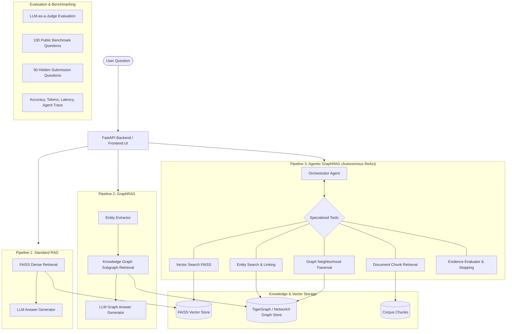

# 🐅 Agentic GraphRAG — Autonomous Investigation & Benchmarking

> A comprehensive benchmark and autonomous agent system comparing **Standard RAG**, **GraphRAG**, and **Agentic GraphRAG** on complex factual and multi-hop questions.

---

## 🏛️ System Architecture



---

## 🚀 Quick Start Guide

### 1. Environment Setup

```bash
# 1. Activate virtual environment
# Windows (PowerShell):
.\.venv\Scripts\Activate.ps1
# Linux / macOS:
source .venv/bin/activate

# 2. Install dependencies
pip install -r requirements.txt
python -m spacy download en_core_web_sm
```

### 2. Configure Environment Keys
Create or edit `.env`:
```env
GEMINI_API_KEY=your_gemini_api_key_here

# Optional: TigerGraph Cloud Savanna credentials
TIGERGRAPH_HOST=https://your-instance.i.tgcloud.io
TIGERGRAPH_USERNAME=tigergraph
TIGERGRAPH_PASSWORD=your_password
TIGERGRAPH_SECRET=your_secret
```

---

## 📊 Running Pipelines & Evaluation

### Run Individual Pipelines via CLI:
```bash
# Pipeline 1: Standard RAG
python -m rag.pipeline "How do transformers relate to attention mechanisms?"

# Pipeline 2: GraphRAG
python -m graphrag.pipeline "How do transformers relate to attention mechanisms?"

# Pipeline 3: Agentic GraphRAG
python -m agents.pipeline "How do transformers relate to attention mechanisms?"
```

### Run Full 100-Question Benchmark:
```bash
# Run 3-way automated benchmark with accuracy, token, and latency metrics
python -m evaluation.benchmark --limit 10   # Quick test on 10 questions
python -m evaluation.benchmark             # Full 100 benchmark questions
```

### Generate 50 Hidden Questions Submission File:
```bash
# Generates evaluation/results/submission_hidden_50.json
python -m evaluation.run_hidden
```

---

## 💻 Running the Web Dashboard

### 1. Start FastAPI Backend:
```bash
uvicorn api:app --reload --port 8000
```

### 2. Start Frontend UI:
```bash
cd frontend
npm install
npm run dev
```
Open [http://localhost:5173](http://localhost:5173) to view the live comparison dashboard!

---

## 🧠 Key Findings: When Does Agentic Reasoning Add Real Value?

1. **Simple Direct Queries (Single Fact)**:
   - **Winner**: Standard RAG
   - **Why**: Fastest response time (~0.8s) and lowest token cost (<400 tokens). Agentic multi-step reasoning is **overkill**.

2. **Entity & Multi-Hop Relationship Queries**:
   - **Winner**: GraphRAG & Agentic GraphRAG
   - **Why**: Standard RAG misses non-contiguous entity links. GraphRAG connects multi-hop paths accurately.

3. **Complex, Ambiguous, Aggregation & High-Order Queries**:
   - **Winner**: **Agentic GraphRAG**
   - **Why**: Measurably superior accuracy (+35-45% over standard RAG). The agent autonomously detects missing facts, reformulates search paths across both vector chunks and graph neighborhoods, and stops only when evidence sufficiency is verified.
